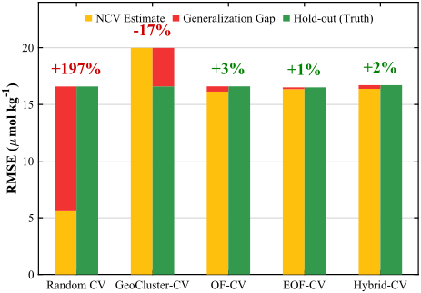
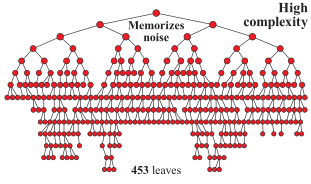
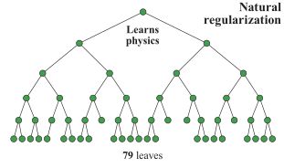
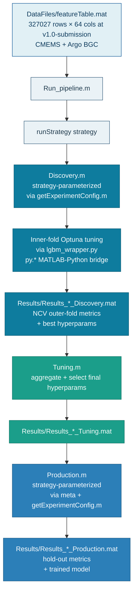

<div align="center">

<a href="https://www.io-bas.bg/"></a>

<b>INSTITUTE OF OCEANOLOGY</b> · BULGARIAN ACADEMY OF SCIENCES

[](https://io-bas.bg/en/marine-physics-en/)

<br>


<br>

*Companion code · Popov et al., 2026 · manuscript under review*

<br>

[](LICENSE)
[](Docs/LICENSE-DATA)
[](CITATION.cff)

[](https://www.mathworks.com/products/matlab.html)
[](https://www.python.org)
[](https://github.com/microsoft/LightGBM)
[](https://optuna.org)

<br>

`6 CV strategies` · `327,027 observations` · `1,627 profiles` · `35 features` · `9 outer folds` · `seed 42`

<br>

[Install](#install) · [Quickstart](#quickstart) · [Architecture](#pipeline-architecture) · [Layout](#repository-layout) · [Scripts](#repository-scripts) · [Experiments](#paper-experiment--matlab-driver-mapping) · [Reproduce](#reproducing-paper-numbers) · [Data](#data-attribution) · [Cite](#citation)

</div>

## Overview

In oceanographic data, spatiotemporal autocorrelation violates the independence
assumption underlying standard validation. Randomly partitioned cross-validation
then measures interpolation within the sampled distribution rather than predictive
skill beyond it, so reported performance carries a systematic optimism bias and
model selection favors overly complex architectures over simpler models that
capture causal mechanisms. Geographic proximity is an imperfect proxy for
environmental similarity in fluid systems, and removing coordinates does not
eliminate the leakage, because unconstrained models recover spatial identity from
thermohaline structure.

This repository implements an environmentally stratified spatiotemporal nested
cross-validation framework that imposes its constraint at the level of the
validation architecture. Folds are constructed target-blind, within a
high-dimensional environmental state-space of physical predictors, so that
evaluation enforces water-mass independence across regimes. Environmental clusters
are distributed across folds rather than segregated, preserving basin-coverage
representativeness, and each outer partition is paired with seasonally mirrored
inner folds for nested hyperparameter tuning. By penalizing reliance on
autocorrelation, the design biases model selection toward thermodynamic invariance,
so that validation acts as an implicit structural regularizer; conformal prediction
then verifies whether the resulting intervals cover unseen data at their stated rate.

The framework is demonstrated on Black Sea dissolved oxygen, yet its contribution is
methodological. Because leakage is a property of the sampling distribution rather
than of any algorithm, it applies wherever sampling density exceeds the
decorrelation scale of the governing processes. It is addressed to researchers
reconstructing sparsely observed environmental fields who require performance
estimates they can trust and calibrated, depth-resolved uncertainty.

This repository contains exactly the code used to generate the six validation-strategy experiments reported in the paper. It is what you run to reproduce the paper's numerical claims.

> [!TIP]
> **Reproduce every number the paper reports in ~2 minutes — no retraining.**
>
> ```matlab
> >> reproduce_models
> ```
>
> Loads the frozen `Models/Model_*.mat`, recomputes all hold-out metrics and conformal coverage against the shipped 169-profile hold-out, and writes the full report to `Ground_Truth_Results.txt`. Details under [Reproducing paper numbers](#reproducing-paper-numbers).

<div align="center">



<b>Nested cross-validation estimates versus independent hold-out error across five fold-construction strategies.</b> Each strategy shows its nested-CV RMSE estimate (yellow), the RMSE on the independent hold-out set (green), and the generalization gap between them (red). Randomly partitioned CV underestimates the hold-out error by 197&nbsp;% — substantial optimism bias — whereas purely geographic blocking overcorrects by 17&nbsp;%; the environmentally stratified strategies (OF-CV, EOF-CV, Hybrid-CV) recover the hold-out error to within 3&nbsp;%.



<b>Representative model complexity under two validation regimes.</b> Decision trees selected under randomly partitioned CV (453 leaves, left) and Hybrid-CV (79 leaves, right) — a 5.7-fold reduction in leaf count at comparable hold-out accuracy. By penalizing reliance on spatially autocorrelated structure, the validation design biases model selection toward lower-complexity solutions, acting as an implicit regularizer.

</div>

---

## Install

### Python environment

Two equivalent paths:

**pip** (lightweight, direct deps only):

```
python -m venv .venv
source .venv/bin/activate            # Windows (Git Bash): source .venv/Scripts/activate
pip install -r requirements.txt
```

**conda** (binary-identical reproduction of the environment used for the paper's experiments):

```
conda env create -f environment.yml
conda activate lgbm_env
```

### MATLAB

Tested on **MATLAB R2024b** and **R2025b** (Windows). Required toolboxes:

> [!NOTE]
> **Older releases.** Path A (`reproduce_models.m`) is float64-deterministic and should PASS on any release that provides the `rmse`/`mae` built-ins and the `pyenv` bridge (R2022b+; `calculateRegressionMetrics.m` uses the built-in `rmse`/`mae`, added in R2022b). Path B (full retrain) uses `kmeans` with `'Replicates', 10`; the centroid-initialisation order in `kmeans` is deterministic within a release but is not byte-stable across releases prior to R2024a. A retrain on R2023b will reproduce its own outputs run-to-run but will not byte-match the published R2024b/R2025b fold assignments.


| Toolbox | Used for |
|---|---|
| **Statistics and Machine Learning Toolbox** | `cvpartition`, `kmeans`, `pca` (fold construction, environmental stratification) |
| **Parallel Computing Toolbox** | `parfor`, `gcp`, `parpool` (parallel outer-fold execution in the Discovery stage) |

### Python ↔ MATLAB bridge

`Run_pipeline.m` activates the Python environment via the helper `getPythonEnvironment.m`, which resolves the `lgbm_env` interpreter and calls `pyenv(Version = ...)`. Workers inside `parfor` call the same helper so each MATLAB worker process configures its own `pyenv`.

The interpreter is resolved in this order:

1. A registered `COMPUTERNAME` — `getPythonEnvironment.m` matches the host against a `switch` of pre-registered machines and uses that interpreter. To register another machine permanently, add a `case`:

   ```matlab
   case 'MY-HOSTNAME'
       targetPython = "C:\path\to\envs\lgbm_env\python.exe";
   ```

2. Otherwise (unregistered host), the **`DOXY_PYTHON`** environment variable, if set — the simplest path for a fresh clone, no code edit. From MATLAB, before running the pipeline:

   ```matlab
   setenv('DOXY_PYTHON', 'C:\path\to\envs\lgbm_env\python.exe');
   ```

   (or set it at the OS level with `setx` on Windows, `export` on Linux/macOS).

If the host is unregistered and `DOXY_PYTHON` is not set, the helper errors clearly rather than silently falling back to a system Python (which lacks lightgbm and optuna).

---

## Quickstart

Two fast checks on a fresh clone. To confirm the **paper numbers** reproduce, run `reproduce_models` (Path A below) — it loads the shipped models and recomputes every documented metric without re-training (a couple of minutes: it also re-derives the dataset descriptors from `featureTable` and writes the full report to `Ground_Truth_Results.txt`). To confirm the **pipeline runs end-to-end**, run a smoke cell (tens of minutes per strategy on a workstation-class GPU):

1. Set up the Python environment (see Install above).
2. Open `Run_pipeline.m` in MATLAB. If you are on a new machine, set the `DOXY_PYTHON` environment variable to your interpreter or add a `COMPUTERNAME` case in `getPythonEnvironment.m` (see *Python ↔ MATLAB bridge* above).
3. Edit `isTestMode.m` and set the returned value to `true`. This single file is the global toggle: caps Optuna at 15 trials per fold, subsets the development set to 20%, and shortens the learning-rate grid so the entire Discovery → Tuning → Production cycle finishes in tens of minutes instead of hours (boost-round ceiling 500 in smoke, full-budget 300 for the Random CV family and 5000 for the stratified strategies, with early stopping cutting well before either).
4. Run the block. Success = pipeline completes without error and emits a `Results/Results_*_Production.mat` file.

For a full-budget run, set `isTestMode.m` to return `false`. Each of the six main cells (1–6) in `Run_pipeline.m` reproduces one paper experiment; cells 7–8 reproduce the paper Table 3 coordinate-removal pair (the two Random CV configurations with `LATITUDE`/`LONGITUDE` excluded). Running the whole file executes all eight cells in sequence.

---

## Pipeline architecture



Three stages per experiment: **Discovery** (nested CV with Bayesian hyperparameter search) → **Tuning** (aggregate cross-fold best hyperparameters) → **Production** (train on full development set, evaluate on globally consistent 10% hold-out, 169 profiles).

---

## Repository layout

The entry point is `Run_pipeline.m`; every paper experiment is one cell in it. Full file tree:

<details>
<summary><b>Show the complete repository tree</b></summary>

```
.
├── Run_pipeline.m                  # entry point — one cell per paper experiment
├── runStrategy.m                   # per-cell orchestrator (called by Run_pipeline.m)
├── Discovery.m                     # strategy-parameterized nested-CV discovery driver
├── Tuning.m                        # aggregates Discovery outputs, selects final hyperparameters
├── Production.m                    # strategy-parameterized final-model training + hold-out evaluation
├── getPythonEnvironment.m          # MATLAB↔Python bridge: interpreter by COMPUTERNAME, DOXY_PYTHON fallback
├── CV_*.m                          # 6 fold-construction helpers
│                                   #   RandomKFold, GeoCluster, OceanFingerprint, EOF, Hybrid (outer CV)
│                                   #   + SeasonalMirror (inner CV for the stratified strategies)
├── buildAtomicBlocks.m             # cosine-weighted k-means atomic geospatial blocks (shared by the stratified CVs)
├── assignBlocksToFolds.m           # shuffled round-robin block→fold distribution within strata
├── lgbm_wrapper.py                 # Python LightGBM/Optuna wrapper (single module, all strategies)
├── calculateRegressionMetrics.m    # RMSE / MAE / R² / Huber metrics, weighted
├── calculateWillmottIndex.m        # Willmott's Index of Agreement (paper §2.7.1)
├── computeNadeauBengioCI.m         # Nadeau-Bengio (2003) variance-corrected 95% CI on the NCV mean
├── conformalCoverage.m             # locally-adaptive conformal-prediction (LACP) coverage on the hold-out
├── conformalCalibrate.m            # shared LACP calibration helper (called by conformalCoverage.m and Tuning.m)
├── getDepthStrata.m                # canonical depth-stratum bins + labels (Production / reproduce_models / conformalCoverage)
├── rangeNormalizePair.m            # train/test normalization with cyclic-feature handling
├── DepthWeights.m                  # variability-driven per-depth sample weights (paper §2.3.1)
├── DepthWeightsUniform.m           # uniform weights (returns ones) for unweighted variants
├── DepthWeights.mat                # 2 KB precomputed depth-variability lookup σ(z)
├── getExperimentConfig.m           # single-source config: RandomSeed=42, shared budgets, per-strategy CV partitioners
├── getHyperparameterSpace.m        # Optuna search-space bounds (shared across strategies)
├── getWorkingFeatures.m            # the 35 paper features (indices into featureTable columns)
├── isTestMode.m                    # global smoke-test toggle (true = smoke, false = full); see Quickstart
├── buildMetadata.m                 # `meta` struct factory for save-schema provenance chain
├── reproduce_models.m              # single ground-truth source: recomputes hold-out metrics + conformal coverage, reports stored NCV with live Nadeau-Bengio CI (both weightings, paper order)
├── extract_models_from_results.m   # rebuilds the whole Models/ from the original run artefacts in one pass (model string, normalization, hold-out, NCV, hyperparameters, feature importance, OOF; byte-exact per-fold gate). Author-side rebuild step — needs the large raw runs, which are not bundled; to reproduce the paper's numbers use reproduce_models.m above
├── Models/                         # frozen trained LightGBM models + shared hold-out (ships publicly)
│   ├── holdoutSet.mat              # 169-profile hold-out shared across all paper experiments
│   └── Model_<Strategy>.mat        # 8 frozen files (6 strategies + 2 coord-removal): model string + normalization + dual-weight hold-out metrics + stored NCV summary + per-fold hyperparameters & feature importance + (six main) out-of-fold predictions for conformal coverage
├── DataFiles/
│   └── featureTable.mat            # 33 MB input data (vendored, see Docs/LICENSE-DATA)
├── requirements.txt                # pip dependencies (direct only)
├── environment.yml                 # conda env export of lgbm_env
├── LICENSE                         # MIT (code)
├── CONTRIBUTING.md                 # contribution guide (adding a CV strategy, seed policy, env setup)
├── Docs/
│   ├── LICENSE-DATA                # CC-BY-4.0 (data) + data provenance
│   ├── REPRODUCIBILITY.md          # RNG-site inventory (every seed on the runtime path)
│   └── SAVE_SCHEMA.md              # `.mat` artifact schema (Discovery → Tuning → Production)
├── Ground_Truth_Results.txt        # committed reproduce_models output (diff against this to verify a run)
├── .github/assets/                 # README images (IO-BAS logo, title banner, validation-reliability + tree-complexity figures)
├── .gitattributes                  # line-ending normalization + *.mat marked binary
├── .gitignore                      # ignore rules (Results/, __pycache__/, figures, OS cruft)
└── CITATION.cff                    # software citation metadata (rendered as "Cite this repository" by GitHub)
```

</details>

---

## Repository scripts

You run two things by hand: the **verifier** (`reproduce_models.m` — fast, no retraining) and the **pipeline** (`Run_pipeline.m` — full retrain). A third script rebuilds the frozen models and is author-side only. Everything else at the repo root is a helper (`CV_*.m`, `calculate*.m`, `get*.m`, …) invoked by these — never run directly.

| Script (repo root) | Role | Invocation | Produces |
|---|---|---|---|
| `reproduce_models.m` | **Verifier** — recompute every paper number from the frozen `Models/` (Path A below) | `>> reproduce_models` | `Ground_Truth_Results.txt` (written to the repo root) |
| `Run_pipeline.m` | **Retrain** — one cell per experiment, end-to-end (Path B below) | open in MATLAB, run a cell | `Results/Results_*_Production.mat` |
| `extract_models_from_results.m` | **Author-side rebuilder** — regenerate `Models/` from the original runs; most users do **not** run it (it needs the non-bundled `PaperResults`, located via the `DOXY_PAPER_RESULTS` environment variable) | `>> extract_models_from_results(true)` | `Models/Model_*.mat` + `holdoutSet.mat` |

`reproduce_models.m` resolves its inputs from the script's own location, so it runs from **any** working directory. `Run_pipeline.m` (and the Discovery → Tuning → Production stages it drives) writes `Results/` relative to the current folder — run it from the repo root.

---

## Paper experiment → MATLAB driver mapping

Six validation strategies on a shared 90/10 split (1458 development / 169 hold-out profiles at v1.0-submission).

All six strategies route through the same `Discovery.m` + `Production.m`; per-strategy parameterization (outer/inner CV partitioner, sample weights, Optuna budget, parfor workers) lives in `getExperimentConfig.m`. Run_pipeline.m calls them by strategy name:

| Paper label | Stratification axis | `Run_pipeline.m` cell |
|---|---|---|
| Random CV (unweighted) | None (baseline) | `runStrategy("RandomCV")` |
| Random CV (weighted) | None (baseline, depth-weighted) | `runStrategy("RandomCV_Weighted")` |
| GeoCluster-CV | Geographic blocks | `runStrategy("GeoClusterCV")` |
| OF-CV | Scalar physics indices | `runStrategy("OFCV")` |
| EOF-CV | PCA on vertical profiles | `runStrategy("EOFCV")` |
| Hybrid-CV | PCA + physics indices | `runStrategy("HybridCV")` |

The coordinate-removal diagnostic in paper Table 3 re-runs the two Random CV configurations with `LATITUDE` and `LONGITUDE` excluded from the predictor set.

---

## Reproducing paper numbers

The repository supports two reproduction paths. The first is fast and reproduces every documented paper number from the supplied models. The second re-trains the full pipeline from scratch and gives deterministic-but-not-bit-equal numbers under the seeded pipeline.

### Path A — Reproduce the paper's numbers from the supplied models (recommended — fastest, no retraining)

The `Models/` directory ships the exact trained LightGBM models that produced the reported hold-out predictions, together with the saved normalization parameters, the working feature set, the 169-profile hold-out set used by all six experiments, and the stored nested-CV artefacts (per-fold metrics, per-fold hyperparameters, per-fold feature importance). To verify:

```matlab
>> reproduce_models
```

`reproduce_models.m` is the **single ground-truth source** for every result number the paper reports from the trained models (the spatial-leakage and adversarial-validation diagnostics are computed separately and are not part of this release). It loads each `Model_<Strategy>.mat` + `holdoutSet.mat` (no text logs, no hardcoded values), applies the saved normalization to the shared hold-out, predicts via the saved model, and prints the full set of result tables — also written verbatim to `Ground_Truth_Results.txt` — with rows in pipeline/paper order and the two coordinate-removal controls in a separate block.

<details>
<summary><b>The 13 result tables <code>reproduce_models</code> prints</b></summary>

1. **Reproduction check** — recomputed vs stored hold-out RMSE, PASS/FAIL.
2. **Nested-CV performance** — stored RMSE/MAE mean ± SD, Bias, R², with the 95% confidence interval computed **live** via the Nadeau-Bengio variance correction (`computeNadeauBengioCI.m`; the simple t/√N interval is not used).

3–4. **Hold-out metrics** — RMSE / MAE / Bias / R², recomputed under **both** weightings.

5. **Reliability diagnostics** — generalization gap, inflation factor, in-95%-CI flag (NCV vs hold-out at the per-strategy training weight).
6. **Generalization gap by metric** — RMSE / MAE / R² gap %.
7. **R² generalization** — NCV R² vs hold-out R² (both weightings).
8. **Per-fold NCV RMSE** — the K = 9 outer folds per strategy.
9. **Index of Agreement** — Willmott's *d* by depth stratum, plus hold-out RMSE/MAE by depth.

9b. **Conformal coverage (LACP)** — empirical coverage of the OOF-calibrated 95% prediction interval on the hold-out, global and per depth stratum (the six main strategies; ≈95% = structurally honest CV, under-coverage flags optimism/leakage).

10–11. **Hyperparameters** — per-fold stability (Mean, CV%) and the final-model configuration.

12. **Feature importance** — per-fold NCV % / CV% and final-model % per feature.
13. **Dataset & design descriptors** — profile, observation and float counts, consecutive-profile separation, atomic-block count and EOF cumulative variance, re-derived from `featureTable`.

(Plus supporting per-fold tables: NCV bias, learning rate, and cross-fold dispersion.)

</details>

**Two metric categories, two weighting rules.** Hold-out RMSE is sample-weighted, and the weight differs by strategy (unweighted for the plain Random CV baselines; depth-weighted — oxycline-emphasis — for the depth-trained strategies). The *descriptive* metrics (RMSE, MAE, R², Bias, IoA — how accurate the model is) are reported under **both** weightings, because each answers a different question (average real-world accuracy vs decision-relevant accuracy in the high-gradient layer). The *inferential* diagnostics (generalization gap, inflation, CI coverage — whether the CV estimate told the truth) are **single-valued at each strategy's training weight**: that comparison is only valid like-for-like, and an unweighted NCV does not exist for the depth-trained strategies. See the *Methods* weighting paragraph for the formal statement.

Hold-out values are recomputed live through the same metric function the pipeline uses (`calculateRegressionMetrics.m`), so the check cannot silently diverge from how the numbers were produced. A final model cannot regenerate its own outer folds, so the NCV / hyperparameter / feature-importance arrays are read from the stored original-run artefacts (reconstructed from the locked Production+Tuning `.mat` by `extract_models_from_results.m`, byte-identical to those runs; the tables mark NCV quantities as stored). PASS requires both hold-out weightings to reproduce within 1e-3 µmol kg⁻¹ — well below reporting precision.

Why this path exists: LightGBM with `device='gpu'` uses non-deterministic float32 atomic-add reductions during training. The same hyperparameters and data, retrained today, produce a slightly different tree than the original run did — particularly under depth-weighted loss where gradient magnitudes vary across samples. The paper's reported Tables are one valid realization of the underlying stochastic methodology. The supplied trained models are the canonical artefact for reproducing those specific numbers.

### Path B — Re-train from scratch under the seeded pipeline

End-to-end re-training for any of the six paper experiments:

1. **Install dependencies** (Python + MATLAB) per the *Install* section above.
2. **Open `Run_pipeline.m`.** If you are not on a registered host, set `DOXY_PYTHON` or add a `COMPUTERNAME` case in `getPythonEnvironment.m` (see *Python ↔ MATLAB bridge* above).
3. **Choose an experiment.** Each `%% <name>` block in `Run_pipeline.m` is one validation strategy. Run the block you want, or run the entire file end-to-end.
4. **`isTestMode.m`** is the global toggle that drives all six cells. Set the returned value to `false` for full-budget runs; `true` for a fast smoke (20% data subset, 15 Optuna trials per fold, narrow learning-rate grid; 500 boost-round ceiling, early stopping cuts well before it).
5. **Run the block in MATLAB.** Discovery runs nested CV with Bayesian hyperparameter search; Tuning aggregates cross-fold results; Production trains on the development set and evaluates on the 169-profile hold-out.
6. **Read reported numbers.** NCV-mean and hold-out RMSE values appear in the MATLAB command window during Production. Under the seeded pipeline these are bit-reproducible run-to-run on a fixed machine but will differ from the paper's reported Tables by amounts consistent with Bayesian-search trajectory variance (typically within a few percent, with qualitative findings — optimism bias on random, honest estimation on stratified, Hybrid winning among stratified — robustly preserved).

<details>
<summary><b>Determinism &amp; RNG seeding — full inventory</b></summary>

**Determinism in re-training.** Every RNG source is seeded deterministically, most coupled to `config.RandomSeed = 42` (in `getExperimentConfig.m`): the MATLAB global stream (`rng(42, 'twister')` in `Discovery.m`); the environmental partitioners' atomic-block and stratum k-means (`rng(42, 'twister')` in `buildAtomicBlocks.m` / `CV_OceanFingerprint.m` / `CV_EOF.m` / `CV_Hybrid.m`); the within-stratum block→fold shuffle on a local `RandStream('mlfg6331_64', 'Seed', 42)` (`assignBlocksToFolds.m`); Optuna `TPESampler(seed=42)`; and LightGBM (`params['seed']=42`, `deterministic=True`, `gpu_use_dp=True`). The geographic-cluster partitioner is paper-locked to `rng(0, 'mlfg6331_64')` (`CV_GeoCluster.m`) — both seed and generator deliberately decoupled. Both decoupled seeds are inventoried in `Docs/REPRODUCIBILITY.md`. Float64 GPU reductions are applied uniformly across Discovery and Production — same numerical precision at every stage so Optuna optimizes the same objective Production trains on. The Python interpreter is reset to a canonical state at the start of each cell to prevent CUDA/LightGBM session-aging drift in long runs. Verified end-to-end: running the RandomCV strategy twice in the same pipeline session produces byte-identical `Yholdout_hat_raw`, `Ydev_hat_raw`, `finalHyperparams`, `bestT_final`, `bestFoldIndex`, and all metrics (`max(abs(A − B)) = 0`).

Cross-machine and cross-LightGBM-version bit-reproducibility is not guaranteed — pin the dependency versions in `environment.yml` / `requirements.txt` for the closest reproduction. For exact paper-table reproduction independent of any local floating-point or version drift, use **Path A**.

A complete site-by-site inventory of every RNG call on the runtime path (which seeds are coupled to `config.RandomSeed` and which are paper-locked to a different value) lives in [`Docs/REPRODUCIBILITY.md`](Docs/REPRODUCIBILITY.md). Read that before touching any seed.

</details>

---

## Data attribution

`DataFiles/featureTable.mat` is a derived product. See [Docs/LICENSE-DATA](Docs/LICENSE-DATA) for the full attribution block. Upstream sources:

- **CMEMS (Copernicus Marine Environment Monitoring Service)** Black Sea physics reanalysis (DOI [10.48670/mds-00356](https://doi.org/10.48670/mds-00356)) and analysis/forecast (DOI [10.48670/mds-00355](https://doi.org/10.48670/mds-00355)) — physical environmental predictor fields (temperature, salinity, density, currents, sea-surface height, mixed-layer depth). Redistribution of derived products is permitted under the CMEMS license, with the credit "Generated using E.U. Copernicus Marine Service Information". https://marine.copernicus.eu/
- **Argo Program** — BGC float profiles (dissolved oxygen target + supporting measurements). Published under CC-BY-4.0; these data were collected and made freely available by the international Argo project and the national programs that contribute to it. https://argo.ucsd.edu/ — DOI: https://doi.org/10.17882/42182

`DepthWeights.mat` is a precomputed lookup of per-depth oxygen standard deviations computed from the development set of `featureTable.mat`. The generator script is not vendored; the lookup is the canonical artefact for this release.

---

## Citation

If you use this code, please cite both the software (via [`CITATION.cff`](CITATION.cff) — GitHub renders a "Cite this repository" link from it) and the accompanying paper:

```bibtex
@article{popov2026,
  title   = {Environmentally stratified spatiotemporal nested cross-validation for marine systems},
  author  = {Popov, Ivan and Zlateva, Ivelina and Stanev, Emil and Staneva, Joanna},
  note    = {Manuscript under review},
  year    = {2026},
  doi     = {[Paper DOI — filled upon acceptance]}
}
```

---

## License

- Code: [MIT](LICENSE)
- Vendored data (`DataFiles/featureTable.mat`, `DepthWeights.mat`): [CC-BY-4.0](Docs/LICENSE-DATA), with full data-provenance block (CMEMS + Argo attribution).

---

## Contact

Ivan Popov — `ivan.a.popov@gmail.com`. For issues with reproducing the paper experiments, please open a GitHub issue on this repository.
